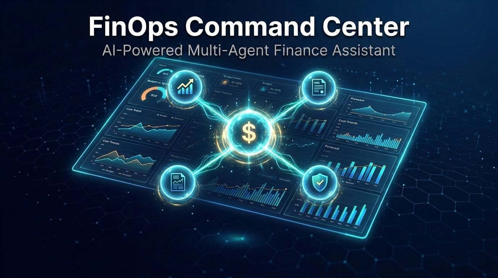

# 💰 FinOps Command Center

> **Enterprise Finance Multi-Agent System** — Built with [Google Agent Development Kit (ADK)](https://google.github.io/adk-docs/)
>
> 🏆 *Kaggle / Google AI Agents Intensive — Capstone Project*

<p align="center">
  
</p>

An intelligent, multi-agent finance operations platform that automates expense analysis, invoice processing, budget forecasting, and compliance auditing through a team of specialized AI agents orchestrated by a central coordinator.

---

## 🏗️ Architecture

```
                         ┌──────────────────────────┐
                         │    👤 User / adk web      │
                         └────────────┬─────────────┘
                                      │
                                      ▼
                         ┌──────────────────────────┐
                         │   🎯 Orchestrator Agent   │
                         │  (root_agent / Router)    │
                         │  ┌──────────────────────┐ │
                         │  │  Session / Memory     │ │
                         │  │  Guardrails Engine    │ │
                         │  └──────────────────────┘ │
                         └──┬──────┬──────┬──────┬──┘
                            │      │      │      │
               ┌────────────┘      │      │      └────────────┐
               ▼                   ▼      ▼                   ▼
  ┌─────────────────────┐ ┌──────────┐ ┌──────────┐ ┌─────────────────────┐
  │  📊 Expense Analyst │ │ 📄 Invoice│ │ 📈 Budget│ │  🔒 Compliance      │
  │       Agent         │ │ Processor│ │ Forecaster│ │    Auditor Agent    │
  │                     │ │   Agent  │ │   Agent  │ │                     │
  │ • Categorization    │ │ • Parse  │ │ • Trend  │ │ • Policy checks     │
  │ • Anomaly detection │ │ • Match  │ │ • Alerts │ │ • Fraud detection   │
  │ • Policy compliance │ │ • Route  │ │ • What-if│ │ • Audit trails      │
  └────────┬────────────┘ └────┬─────┘ └────┬─────┘ └──────────┬──────────┘
           │                   │             │                  │
           └───────────┬───────┴─────────────┴──────┬───────────┘
                       ▼                            ▼
              ┌─────────────────┐         ┌──────────────────┐
              │  🛠️ Agent Tools  │         │  🔌 MCP Server   │
              │  (Python funcs) │         │  (External APIs) │
              └─────────────────┘         └──────────────────┘
```

---

## ✅ Capstone Requirements

| # | Requirement | Status | Implementation |
|---|-------------|--------|----------------|
| 1 | **Multi-Agent System** | ✅ | Orchestrator + 4 specialist agents |
| 2 | **Agent Tools** | ✅ | Custom Python tools for data retrieval, calculations, formatting |
| 3 | **Agent-to-Agent Handoff** | ✅ | LlmAgent transfer via orchestrator routing |
| 4 | **Guardrails / Callbacks** | ✅ | Input validation, PII redaction, amount limits, before/after callbacks |
| 5 | **MCP Server** | ✅ | External financial data server (exchange rates, market data) |
| 6 | **Session & Memory** | ✅ | Persistent session state with conversation context across turns |
| 7 | **Evaluation (Evals)** | ✅ | Pytest-based eval suite with deterministic + LLM-judged criteria |
| 8 | **Deployment** | ✅ | `adk web` local deployment with `.env` configuration |

---

## 🚀 Quick Start

### Prerequisites

- Python 3.10+
- A [Google AI Studio API Key](https://aistudio.google.com/apikey)

### Installation

```bash
# Clone the repository
git clone https://github.com/your-username/finops-agent.git
cd finops-agent

# Create and activate virtual environment
python -m venv .venv
source .venv/bin/activate  # macOS/Linux
# .venv\Scripts\activate   # Windows

# Install dependencies
pip install -e .

# Configure your API key
cp .env.example .env
# Edit .env and add your GOOGLE_API_KEY

# Launch the agent
adk web finops_agent
```

Then open **http://localhost:8000** in your browser.

---

## 💬 Usage Examples

Try these queries in the ADK web interface:

| Query | Agent Activated |
|-------|-----------------|
| *"Show me all pending expenses over $5,000"* | Expense Analyst |
| *"Process invoice INV-003 from BrightPixel Design Studio"* | Invoice Processor |
| *"Which departments are over budget this quarter?"* | Budget Forecaster |
| *"Run a compliance check on last month's travel expenses"* | Compliance Auditor |
| *"Give me a full financial health report for Q3 2026"* | Orchestrator → All Agents |

---

## 📁 Project Structure

```
finops-agent/
├── pyproject.toml               # Project config & dependencies
├── .env.example                 # API key template
├── README.md                    # This file
├── data/
│   ├── sample_expenses.json     # Sample expense records
│   ├── sample_invoices.json     # Sample invoices with line items
│   └── sample_budgets.json      # Departmental budget entries
├── finops_agent/
│   ├── __init__.py              # Package root
│   ├── agent.py                 # Root agent definition (entry point for adk web)
│   ├── agents/
│   │   ├── __init__.py
│   │   ├── orchestrator.py      # Main orchestrator — routes to specialists
│   │   ├── expense_tracker.py   # Expense tracking sub-agent
│   │   ├── budget_analyst.py    # Budget analysis & forecasting sub-agent
│   │   ├── invoice_parser.py    # Invoice processing sub-agent
│   │   └── reporting_agent.py   # Financial reporting sub-agent
│   ├── tools/
│   │   ├── __init__.py
│   │   ├── db.py                # In-memory data store (singleton)
│   │   ├── expense_tools.py     # Expense CRUD & analytics
│   │   ├── budget_tools.py      # Budget status, forecasts & alerts
│   │   ├── invoice_tools.py     # Invoice parsing, validation & approval
│   │   └── reporting_tools.py   # Financial report generation
│   ├── mcp_server/
│   │   ├── __init__.py
│   │   └── finance_mcp.py       # MCP server (exchange rates, tax, policies)
│   ├── guardrails/
│   │   ├── __init__.py
│   │   ├── input_validator.py   # PII redaction & prompt injection blocking
│   │   └── budget_guard.py      # Spending limit enforcement
│   ├── memory/
│   │   ├── __init__.py
│   │   └── session_manager.py   # Session & memory service config
│   └── eval/
│       ├── __init__.py
│       └── test_cases.py        # 20 evaluation scenarios
└── tests/
    ├── __init__.py
    ├── test_tools.py            # Unit tests for all tools
    └── test_agents.py           # Integration tests for agents
```

---

## 🛠️ Tech Stack

| Component | Technology |
|-----------|------------|
| Agent Framework | [Google Agent Development Kit (ADK)](https://google.github.io/adk-docs/) |
| LLM | Google Gemini (via `google-adk`) |
| External Data | [Model Context Protocol (MCP)](https://modelcontextprotocol.io/) |
| Language | Python 3.10+ |
| Testing | Pytest + ADK Eval |
| Deployment | `adk web` local server |

---

## 📊 Sample Data

The `data/` directory contains realistic financial records for demonstration:

- **Expenses** — 18 records across 6 categories (Travel, Software, Marketing, Office Supplies, Meals & Entertainment, Professional Services) with approved/pending/rejected statuses
- **Invoices** — 9 vendor invoices with detailed line items, payment terms, and notes
- **Budgets** — 8 departmental budgets for Q3 2026 (2 intentionally over-budget for anomaly detection demos)

---

## 📄 License

This project is licensed under the [Apache License 2.0](https://www.apache.org/licenses/LICENSE-2.0).

```
Copyright 2026 FinOps Command Center Contributors

Licensed under the Apache License, Version 2.0 (the "License");
you may not use this file except in compliance with the License.
You may obtain a copy of the License at

    http://www.apache.org/licenses/LICENSE-2.0

Unless required by applicable law or agreed to in writing, software
distributed under the License is distributed on an "AS IS" BASIS,
WITHOUT WARRANTIES OR CONDITIONS OF ANY KIND, either express or implied.
See the License for the specific language governing permissions and
limitations under the License.
```

---

<p align="center">
  Built with ❤️ using <a href="https://google.github.io/adk-docs/">Google ADK</a> &amp; <a href="https://ai.google.dev/">Gemini</a>
</p>
